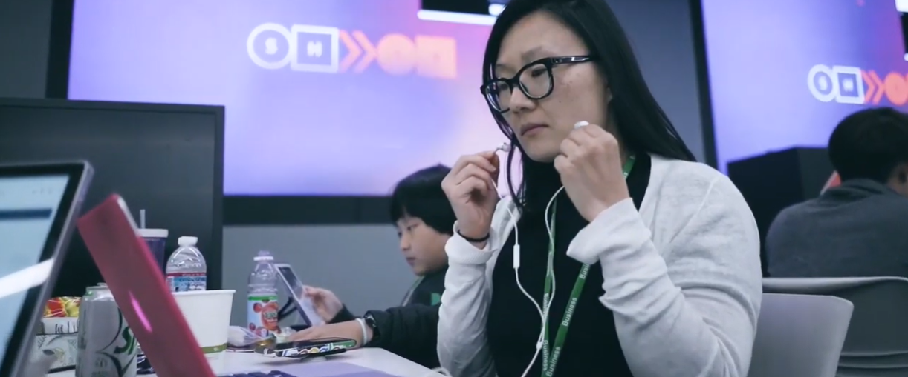

<h2 align="center">

Mi ruta para convertirme en un Ingeniero ML 👨‍💻

</h2>

<h2 align="center">

</h2>

## ℹ️ Descripción
En este repositorio encontrarás tutoriales y proyectos relacionados con Machiche Learning y Deep Learning. El objetivo es que se utilice como un recurso de aprendizaje para los interesados en MLOps, ML Edge y variantes propias de un ML Engineer. A continuación detallo algunos canales sobre los que inspiré, espero le sea de mucha utilidad ;)

- [Aladdin Persson](https://www.youtube.com/c/AladdinPersson)
- [Valerio Velardo - The Sound of AI](https://www.youtube.com/channel/UCZPFjMe1uRSirmSpznqvJfQ)
- [Henry AI Labs](https://www.youtube.com/channel/UCHB9VepY6kYvZjj0Bgxnpbw)

## 📝 Tabla de Contenido

- ✅ [Aplicación MNIST en Flutter](./MNIST-Flutter)
- ✅ [Creación y despliegue en AWS de un modelo de reconocimiento de voz](./Speech-Recognition-Deployment-AWS)
- ⬜️ 